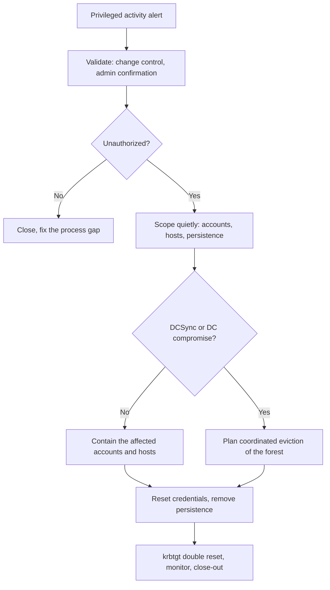

# Active Directory Privileged Compromise

## Scope and Triggers

This playbook covers an attacker with, or close to, privileged access in on-premises Active Directory: a compromised Domain Admin or equivalent account, credential theft from a Domain Controller, or attacks against Kerberos. It starts when:

* An account is added to a privileged group outside of change control
* Microsoft Defender for Identity or another tool alerts on DCSync, Kerberoasting, Golden Ticket, or pass-the-hash activity
* Credential dumping tools are found on a server or Domain Controller
* Another playbook (ransomware, edge device, endpoint malware) shows the attacker used privileged credentials

## Severity

| Severity | Criteria |
| :--- | :--- |
| High | Attacks against Kerberos or attempts at privileged access with no confirmed success |
| Critical | A privileged account or Domain Controller is confirmed compromised, or DCSync succeeded |

Once DCSync or a Domain Controller compromise is confirmed, I treat the whole forest as compromised: the attacker may have every password hash, including `krbtgt`.

## ATT&CK Mapping

* [T1003.006 OS Credential Dumping: DCSync](https://attack.mitre.org/techniques/T1003/006/)
* [T1003.003 OS Credential Dumping: NTDS](https://attack.mitre.org/techniques/T1003/003/)
* [T1558.003 Steal or Forge Kerberos Tickets: Kerberoasting](https://attack.mitre.org/techniques/T1558/003/)
* [T1558.001 Steal or Forge Kerberos Tickets: Golden Ticket](https://attack.mitre.org/techniques/T1558/001/)
* [T1550.002 Use Alternate Authentication Material: Pass the Hash](https://attack.mitre.org/techniques/T1550/002/)
* [T1098 Account Manipulation](https://attack.mitre.org/techniques/T1098/)
* [T1484.001 Domain or Tenant Policy Modification: Group Policy Modification](https://attack.mitre.org/techniques/T1484/001/)

## Data Sources

* Domain Controller Security logs with Advanced Audit Policy enabled (account management, Kerberos, directory service access and changes)
* Microsoft Defender for Identity (`IdentityLogonEvents`, `IdentityDirectoryEvents`, `IdentityQueryEvents`) if deployed
* EDR telemetry from Domain Controllers and admin workstations
* AD replication metadata and object change history

## Flow



## Triage

1. **Validate the change.** I check change tickets and ask the admin who owns the account, by phone. Plenty of privileged group changes are legitimate but undocumented.
2. **Identify the account's recent activity:** where it logged on, from which hosts, and what it changed. A Domain Admin logging on interactively to a workstation is an exposure even if nothing malicious happened.
3. **Decide the scale.** If the activity is limited to one account and a few hosts, I contain them directly. If DCSync, NTDS.dit theft, or code execution on a Domain Controller is confirmed, I move to a planned eviction (below).

## Containment

For a limited compromise:

1. Disable the compromised accounts or reset their passwords; existing Kerberos tickets stay valid until they expire, so I also restart or isolate the hosts where those accounts were used
2. Isolate hosts where the attacker used privileged credentials, especially any with credential dumping tools
3. Remove unauthorized group memberships
4. Block the attacker's access path (the edge device, the phished user, the compromised workstation)

For a forest-level compromise, piecemeal containment tips off the attacker, who may still hold other credentials and respond by deploying ransomware. Instead:

1. **Scope quietly** while monitoring: every account used, every host touched, every persistence mechanism
2. **Plan a coordinated eviction** with leadership and, usually, an outside IR firm: a set time when all actions happen together
3. **During the eviction window:** cut internet access or attacker C2, disable the attacker's accounts, reset privileged and service account passwords, reset `krbtgt` twice, and remove persistence in one pass

## Persistence to Check

* New accounts and unexpected members of Domain Admins, Enterprise Admins, Schema Admins, Administrators, Account Operators, Backup Operators
* `AdminSDHolder` permission changes (these propagate to all protected accounts)
* `SIDHistory` set on regular accounts
* New Group Policy Objects or changes to existing ones, especially scheduled tasks and startup scripts
* Delegation changes: unconstrained delegation, resource-based constrained delegation
* AD CS: new or modified certificate templates, certificates issued to unexpected accounts
* New domain trusts
* DSRM password changes and Directory Services Restore Mode logon settings
* Scheduled tasks and services on Domain Controllers

## Eradication and Recovery

1. Reset the `krbtgt` password twice, waiting for replication between resets, to invalidate forged Kerberos tickets
2. Reset all privileged accounts, service accounts, and the computer accounts of compromised servers
3. Remove all persistence found above
4. If a Domain Controller was compromised at the OS level, rebuild it rather than clean it
5. If the forest cannot be trusted (persistence cannot be ruled out), plan a forest recovery from backups that predate the compromise, following Microsoft's forest recovery guidance
6. Monitor privileged groups, Kerberos activity, and replication requests closely for at least 30 days

## Queries

DCSync: replication requests from accounts that are not Domain Controllers (requires Directory Service Access auditing):

```kql
SecurityEvent
| where TimeGenerated > ago(7d)
| where EventID == 4662
| where Properties has_any ("1131f6aa-9c07-11d1-f79f-00c04fc2dcd2", "1131f6ad-9c07-11d1-f79f-00c04fc2dcd2")
| where SubjectUserName !endswith "$"
| project TimeGenerated, Computer, SubjectUserName, SubjectDomainName, Properties
```

Kerberoasting: RC4 service tickets for user-based service accounts:

```kql
SecurityEvent
| where TimeGenerated > ago(7d)
| where EventID == 4769
| where TicketEncryptionType == "0x17"
| where ServiceName !endswith "$" and ServiceName !~ "krbtgt"
| summarize Tickets = count(), Services = make_set(ServiceName, 50) by TargetUserName, IpAddress
| order by Tickets desc
```

Changes to privileged groups:

```kql
SecurityEvent
| where TimeGenerated > ago(30d)
| where EventID in (4728, 4732, 4756)
| where TargetUserName in~ ("Domain Admins", "Enterprise Admins", "Schema Admins", "Administrators", "Account Operators", "Backup Operators")
| project TimeGenerated, Computer, SubjectUserName, MemberName, TargetUserName
```

Where a privileged account has logged on:

```kql
SecurityEvent
| where TimeGenerated > ago(14d)
| where EventID == 4624
| where TargetUserName =~ "admin-account"
| summarize Logons = count(), LogonTypes = make_set(LogonType) by Computer, IpAddress
```

## Communication

* **Management:** immediately for Critical; a forest-level eviction needs leadership approval because it disrupts the whole business
* **IT staff:** on a need-to-know basis during scoping, by out-of-band channels, because the attacker may be reading email
* **Outside IR firm and cyber insurance carrier:** early, for forest-level compromise

## Close-out

* Keep DC logs, replication metadata, GPO backups (before cleanup), and the full timeline
* Follow-up from the [Active Directory Hardening](../../hardening/active-directory.md) page: tiered admin accounts, Protected Users, LAPS, gMSAs, AES-only Kerberos, regular PingCastle or Purple Knight assessments
* Detections to add: DCSync from non-DCs, RC4 service tickets, privileged group changes, privileged logons outside Tier 0

## Related

* [Active Directory Hardening](../../hardening/active-directory.md)
* [Windows Event Logs](../../siem-and-log-analysis/windows-event-logs.md)
* [New Privileged Account](../alert-triage/new-privileged-account.md)
* [Kerberoasting Hunt](../threat-hunting/kerberoasting.md)
