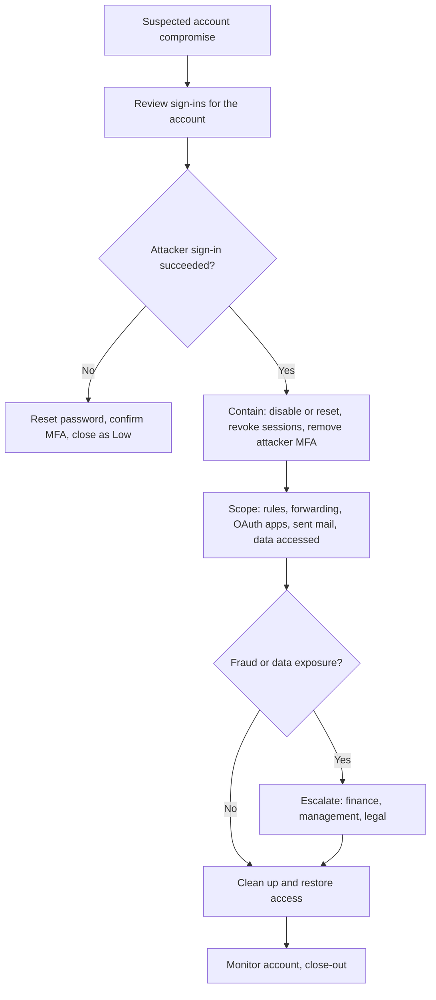

# Compromised Account / BEC

## Scope and Triggers

This playbook covers a Microsoft 365 / Entra ID account that someone other than its owner has used, including business email compromise (BEC), where the attacker uses the mailbox to redirect payments or steal data. It starts when:

* A user entered credentials into a phishing page or approved an MFA prompt they did not initiate
* Identity protection flags a risky sign-in or risky user
* A new inbox rule forwards, deletes, or hides mail
* A vendor or customer asks about a payment change or an odd email that came from our domain
* The user reports sent items or replies they do not recognize

## Severity

| Severity | Criteria |
| :--- | :--- |
| Low | Credentials exposed but no successful sign-in by the attacker (blocked by MFA or Conditional Access) |
| Medium | Attacker signed in but there is no evidence of mailbox changes, data access, or outbound email |
| High | Inbox rules, forwarding, OAuth consent, or outbound phishing from the account; or mail containing sensitive data was accessed |
| Critical | Fraudulent payment requested or made, privileged account compromised, or regulated data exposed |

## ATT&CK Mapping

* [T1078.004 Valid Accounts: Cloud Accounts](https://attack.mitre.org/techniques/T1078/004/)
* [T1621 Multi-Factor Authentication Request Generation](https://attack.mitre.org/techniques/T1621/)
* [T1550.004 Use Alternate Authentication Material: Web Session Cookie](https://attack.mitre.org/techniques/T1550/004/)
* [T1564.008 Hide Artifacts: Email Hiding Rules](https://attack.mitre.org/techniques/T1564/008/)
* [T1114.003 Email Collection: Email Forwarding Rule](https://attack.mitre.org/techniques/T1114/003/)
* [T1098 Account Manipulation](https://attack.mitre.org/techniques/T1098/) (new MFA methods, app registrations)
* [T1534 Internal Spearphishing](https://attack.mitre.org/techniques/T1534/)

## Data Sources

* Entra ID: `SigninLogs`, `AADNonInteractiveUserSignInLogs`, `AuditLogs`, risky users and risky sign-ins
* Microsoft 365 unified audit log: `OfficeActivity` in Sentinel, `CloudAppEvents` in Defender XDR, or Purview Audit search
* Exchange Online PowerShell for current mailbox state
* Email logs: `EmailEvents` for messages the account sent

## Flow



## Triage

1. **Pull the sign-in history** for the last 30 days (see the queries below). I am looking for:
    * IPs, countries, or ISPs the user does not normally use, especially hosting providers and VPN services
    * Unfamiliar devices, browsers, or user agents
    * Sign-ins that succeeded on a single factor, or MFA that was satisfied by a claim in the token (a sign of a stolen session cookie)
    * A burst of MFA denials followed by an approval
2. **Confirm with the user.** I ask whether they were traveling, using a new device, or approved a prompt they did not expect. I contact them by phone or in person, not by email, because the attacker may be reading the mailbox.
3. **Decide.** If the attacker never got in, I reset the password, confirm MFA, and close. If they got in, I contain first and scope second; scoping can wait a few minutes, but an active attacker in a mailbox cannot.

## Containment

I do these in order and quickly. Revoking sessions without resetting the password, or the reverse, leaves a way back in.

1. **Block sign-in or reset the password.** If the account is actively being used for fraud, I disable it first: `Update-MgUser -UserId user@example.com -AccountEnabled:$false`
2. **Revoke all sessions and refresh tokens:** `Revoke-MgUserSignInSession -UserId user@example.com` (or Revoke sessions on the user in the Entra admin center)
3. **Remove attacker MFA methods.** Attackers often register their own authenticator app or phone. I review the user's authentication methods and remove anything the user did not add, then require re-registration.
4. **Block the attacker infrastructure:** the IPs in a Conditional Access named location set to block, and any phishing domains in email and web filtering.
5. **If the account sent phishing internally or externally**, I purge those messages using the [Phishing](phishing.md) playbook steps.

## Scoping

1. **Inbox rules and forwarding.** These are the most common BEC persistence. Attackers create rules that move replies from the victim's contacts to an obscure folder or delete them.
    * `Get-InboxRule -Mailbox user@example.com | Format-List Name, Enabled, From, SubjectContainsWords, BodyContainsWords, MoveToFolder, ForwardTo, RedirectTo, DeleteMessage`
    * `Get-Mailbox user@example.com | Format-List ForwardingSmtpAddress, ForwardingAddress, DeliverToMailboxAndForward`
    * Also check rules created through Outlook on the web and the `UpdateInboxRules` audit operation (see the queries below)
2. **OAuth app consents.** I check Entra ID -> Enterprise applications -> the user's consented apps, and `AuditLogs` for "Consent to application". A malicious app keeps access even after a password reset, so it has to be removed and its consent revoked.
3. **Other account changes:** new devices registered, new app registrations, changes to mailbox delegates or folder permissions.
4. **What the attacker read and sent.**
    * Sent items and `EmailEvents` for outbound mail from the account during the attacker's window
    * `MailItemsAccessed` audit events, if the tenant's audit licensing records them, to see which messages were opened
    * SharePoint and OneDrive file access (`OfficeActivity` with `OfficeWorkload` of SharePoint or OneDrive)
5. **Look for other victims.** I search sign-ins from the attacker IPs across all users, and check whether the attacker emailed other staff from the compromised account.

## Eradication and Recovery

1. Remove malicious inbox rules, forwarding, delegates, OAuth consents, and attacker-registered devices.
2. Re-enable the account with a new password and fresh MFA registration done in person or over a verified call.
3. Review Conditional Access gaps that allowed the sign-in (legacy authentication, no device requirement, no phishing-resistant MFA for high-risk users).
4. Monitor the account's sign-ins and mailbox changes for at least two weeks.

## Queries

Sign-in history for the user, interactive and non-interactive:

```kql
union SigninLogs, AADNonInteractiveUserSignInLogs
| where TimeGenerated > ago(30d)
| where UserPrincipalName =~ "user@example.com"
| project TimeGenerated, IPAddress, Location, AppDisplayName, ClientAppUsed, UserAgent, ResultType, AuthenticationRequirement, ConditionalAccessStatus
| order by TimeGenerated asc
```

Other accounts signing in from the attacker's IPs:

```kql
SigninLogs
| where TimeGenerated > ago(30d)
| where IPAddress in ("203.0.113.10", "198.51.100.25")
| summarize Attempts = count(), Successes = countif(ResultType == "0") by UserPrincipalName, IPAddress
```

Inbox rule and forwarding changes:

```kql
OfficeActivity
| where TimeGenerated > ago(30d)
| where Operation in ("New-InboxRule", "Set-InboxRule", "UpdateInboxRules", "Set-Mailbox")
| where Parameters has_any ("ForwardTo", "RedirectTo", "ForwardingSmtpAddress", "DeleteMessage", "MoveToFolder")
| project TimeGenerated, UserId, ClientIP, Operation, Parameters
```

OAuth consent and MFA method changes:

```kql
AuditLogs
| where TimeGenerated > ago(30d)
| where OperationName in ("Consent to application", "User registered security info", "User changed default security info")
| extend Actor = tostring(InitiatedBy.user.userPrincipalName)
| project TimeGenerated, OperationName, Actor, TargetResources, Result
```

Mail sent by the account during the compromise window:

```kql
EmailEvents
| where Timestamp between (datetime(2026-01-10 08:00) .. datetime(2026-01-11 18:00))
| where SenderFromAddress =~ "user@example.com"
| summarize Recipients = make_set(RecipientEmailAddress, 100), Count = count() by Subject
```

## Communication

* **User:** by phone or in person; explain what happened and what they need to do to get back in
* **Finance / accounts payable:** immediately if the attacker discussed invoices or payment details. If money was sent, the bank needs to be contacted the same day to attempt a recall, and the fraud reported to the [FBI IC3](https://www.ic3.gov/).
* **External contacts the attacker emailed:** a short notice from someone they know, by phone where payments are involved, that the emails were not legitimate
* **Management and legal:** for High or Critical severity, and any time regulated or personal data may have been read, since breach notification requirements may apply

## Close-out

* Keep the sign-in logs, audit log exports, inbox rules (before removal), message traces, and a timeline of attacker activity
* Record how the attacker got in: phishing, password reuse, MFA fatigue, token theft
* Detections to add or tune: new forwarding rules, rules that delete or move mail from external senders, sign-ins from hosting providers, MFA denials followed by approval
* Hardening follow-up: phishing-resistant MFA for high-risk roles, blocking legacy authentication, number matching, payment change verification by phone

## Related

* [Phishing](phishing.md)
* [MFA Fatigue](../alert-triage/mfa-fatigue.md)
* [Impossible Travel](../alert-triage/impossible-travel.md)
* [New Inbox Forwarding Rule](../alert-triage/inbox-forwarding-rule.md)
