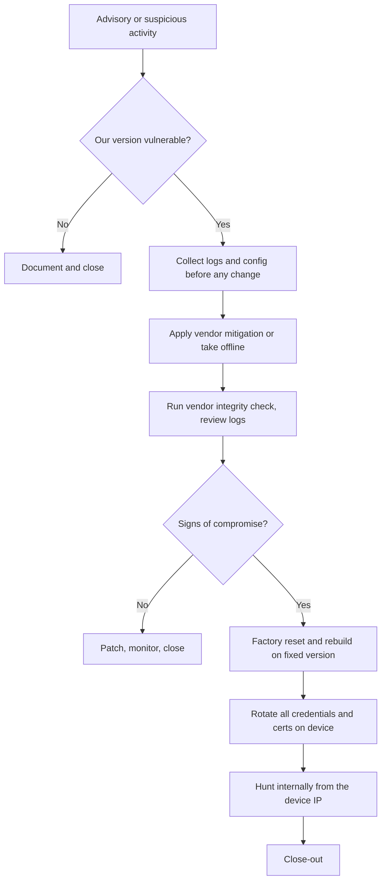

# Exploited Edge Device

## Scope and Triggers

This playbook covers exploitation of an internet-facing network device: a VPN concentrator, firewall, load balancer, remote access gateway, or file transfer appliance. These devices are a leading initial access vector because they sit on the internet, hold credentials, and usually cannot run EDR. It starts when:

* A vendor, CISA, or threat intel publishes an actively exploited vulnerability in a device we run
* The vendor's integrity checker or a scan reports unexpected files or modifications
* Logs show unexpected admin accounts, configuration changes, or crashes on the device
* Internal hosts see logons or scanning from the device's internal IP

## Severity

| Severity | Criteria |
| :--- | :--- |
| Medium | Vulnerable version exposed, mitigation applied, no sign of exploitation |
| High | Indicators of exploitation on the device, no sign of activity beyond it |
| Critical | Activity from the device into the internal network, or credentials stored on the device were used elsewhere |

## ATT&CK Mapping

* [T1190 Exploit Public-Facing Application](https://attack.mitre.org/techniques/T1190/)
* [T1133 External Remote Services](https://attack.mitre.org/techniques/T1133/)
* [T1505.003 Server Software Component: Web Shell](https://attack.mitre.org/techniques/T1505/003/)
* [T1556 Modify Authentication Process](https://attack.mitre.org/techniques/T1556/)
* [T1070 Indicator Removal](https://attack.mitre.org/techniques/T1070/)
* [T1021 Remote Services](https://attack.mitre.org/techniques/T1021/)

## Data Sources

* Device system, admin, and VPN session logs (ideally already forwarded to the SIEM, since attackers clear local logs)
* Vendor integrity checking tools and advisories
* Firewall and NetFlow data for traffic to and from the device
* Windows Security logs and EDR telemetry for internal hosts the device can reach
* Entra ID or LDAP logs for the accounts the device uses to authenticate VPN users

## Flow



## Triage

1. **Confirm exposure.** I check the model and firmware version against the advisory, and whether the vulnerable feature (often the web management interface or the SSL VPN portal) is reachable from the internet.
2. **Read the advisory closely.** The vendor and CISA usually publish indicators, a mitigation, and an integrity checker. CISA's [Known Exploited Vulnerabilities catalog](https://www.cisa.gov/known-exploited-vulnerabilities-catalog) tells me whether exploitation is happening in the wild.
3. **Decide urgency.** An actively exploited, internet-reachable vulnerability on a device we run gets handled immediately, not in the next patch window.

## Containment

1. **Collect evidence first.** Before rebooting, patching, or resetting anything, I export the device logs, running configuration, and any diagnostic bundle or core files the vendor recommends. Some exploits live only in memory and some patches wipe logs.
2. **Apply the vendor mitigation** (disable the vulnerable feature, apply a temporary configuration) or, if there is none and exploitation is active, take the device offline or restrict access to known source IPs.
3. **Restrict the management interface** to internal management networks if it was internet-reachable.

## Investigation

1. **Run the vendor integrity checker** and review its output. Some exploits tamper with the built-in checker, so I use the external version when the vendor provides one.
2. **Review device logs** for new or changed admin accounts, configuration changes, unexpected reboots or crashes, log gaps, and VPN sessions from unusual IPs or for accounts that never use VPN.
3. **Check traffic from the device.** Edge devices rarely start outbound connections to the internet, and rarely log on to internal servers. I look at firewall logs for both.
4. **Hunt internally from the device's internal IP.** Attackers use the device as a beachhead: LDAP queries, SMB and RDP connections, and logons with the service accounts the device uses.
5. **Check the credentials the device holds.** VPN appliances often store an LDAP or AD bind account, RADIUS secrets, local admin passwords, and private keys. I check where those accounts have logged on.

## Eradication and Recovery

1. **Rebuild if compromised.** If there are any signs of compromise, I factory reset the device and rebuild it on a fixed version from a known-good configuration, instead of patching in place. Patching does not remove attacker persistence.
2. **Rotate everything the device knew:** admin passwords, bind and service account passwords, RADIUS and pre-shared secrets, and certificates and private keys.
3. **Reset passwords** for VPN users who authenticated during the exposure window if the exploit could expose credentials or sessions.
4. **Patch** to the fixed version, then re-run the integrity check.
5. If the attacker reached internal systems, move to the [Active Directory Privileged Compromise](ad-privileged-compromise.md) or [Ransomware](ransomware.md) playbooks as appropriate.

## Queries

Internal logons from the device's internal IP or with its service account (Windows Security log):

```kql
SecurityEvent
| where TimeGenerated > ago(30d)
| where EventID in (4624, 4625, 4768, 4769, 4776)
| where IpAddress == "10.0.0.1" or TargetUserName =~ "svc-vpn-ldap"
| summarize Count = count(), Hosts = make_set(Computer, 50) by EventID, TargetUserName, IpAddress, LogonType
```

Outbound connections started by the device (firewall logs in CEF format):

```kql
CommonSecurityLog
| where TimeGenerated > ago(30d)
| where SourceIP == "198.51.100.1"
| where DestinationPort !in (53, 123)
| summarize Connections = count(), Ports = make_set(DestinationPort, 20) by DestinationIP, DeviceAction
| order by Connections desc
```

VPN sign-ins from unusual locations, when VPN authentication goes through Entra ID:

```kql
SigninLogs
| where TimeGenerated > ago(30d)
| where AppDisplayName has "VPN"
| summarize Users = dcount(UserPrincipalName), UserList = make_set(UserPrincipalName, 20) by IPAddress, Location
| order by Users desc
```

Vulnerable devices from vulnerability management data (when the device is in scope):

```kql
DeviceTvmSoftwareVulnerabilities
| where CveId == "CVE-2026-XXXXX"
| project DeviceName, OSPlatform, SoftwareVendor, SoftwareName, SoftwareVersion, VulnerabilitySeverityLevel
```

## Communication

* **Management:** at High or Critical severity; remote access may be down while the device is rebuilt
* **Users:** if VPN is offline or passwords need to be reset
* **Vendor support:** open a case early; they often have unpublished indicators and recovery guidance
* **CISA:** report confirmed exploitation, which also helps other organizations running the same device

## Close-out

* Keep device logs, configuration exports, integrity checker output, and the timeline
* Confirm device logs are forwarded to the SIEM so the next investigation does not depend on logs the attacker can clear
* Follow-up: management interfaces off the internet, MFA on VPN, a faster process for out-of-band patching of edge devices, subscribing to vendor and CISA advisories

## Related

* [Critical CVE Response](../operations/critical-cve-response.md)
* [Network Device Logs](../../siem-and-log-analysis/network-device-logs.md)
* [Active Directory Privileged Compromise](ad-privileged-compromise.md)
