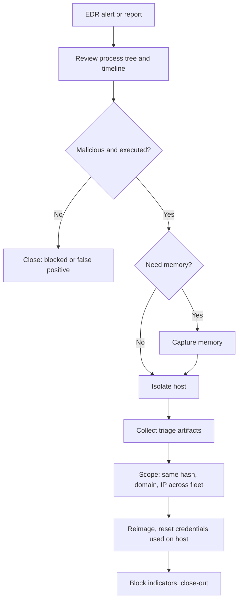

# Endpoint Malware

## Scope and Triggers

This playbook covers malicious code on a workstation or server. It starts when:

* EDR or antivirus raises an alert that was not fully blocked, or was blocked after the malware ran
* A user reports pop-ups, a slow system, or a file that "did nothing" when opened
* The [Phishing](phishing.md) playbook finds an attachment was opened
* Threat intel or a hunt finds a known malicious hash, domain, or IP on the network

## Severity

| Severity | Criteria |
| :--- | :--- |
| Low | Malware blocked before execution; adware or a potentially unwanted program |
| Medium | Commodity malware executed on one workstation with no sign of follow-on activity |
| High | Malware with C2, credential theft, or persistence; or more than one host affected |
| Critical | Malware on a server, Domain Controller, or privileged admin workstation; or hands-on-keyboard activity |

## ATT&CK Mapping

* [T1204 User Execution](https://attack.mitre.org/techniques/T1204/)
* [T1059 Command and Scripting Interpreter](https://attack.mitre.org/techniques/T1059/)
* [T1547 Boot or Logon Autostart Execution](https://attack.mitre.org/techniques/T1547/)
* [T1053 Scheduled Task/Job](https://attack.mitre.org/techniques/T1053/)
* [T1055 Process Injection](https://attack.mitre.org/techniques/T1055/)
* [T1071 Application Layer Protocol](https://attack.mitre.org/techniques/T1071/)
* [T1555 Credentials from Password Stores](https://attack.mitre.org/techniques/T1555/) (infostealers)

## Data Sources

* EDR alert, process tree, and timeline
* `DeviceProcessEvents`, `DeviceFileEvents`, `DeviceNetworkEvents`, `DeviceRegistryEvents`
* Windows Security, System, PowerShell, and Sysmon logs
* Proxy, DNS, and firewall logs
* The malicious file itself, if it can be collected safely

## Flow



## Triage

1. **Read the alert and process tree.** I want to know what launched the file (Outlook, a browser, a USB drive, a script), what it spawned, and what it touched. An Office application spawning PowerShell, or a script in a user's Downloads or Temp folder, tells a lot of the story.
2. **Check the file.** I look up the SHA256 hash in VirusTotal and other reputation sources. If it is unknown, I check signature status, the file path, and when it first appeared in the environment. I do not upload files that may contain company data to public sandboxes.
3. **Check network activity** from the process: domains, IPs, and whether connections succeeded. Successful C2 or an infostealer upload raises severity.
4. **Decide.** Blocked before execution with no other activity: close as Low after confirming the block. Executed: continue.

## Containment

1. **Decide whether memory matters.** For fileless malware, injected code, or anything that looks hands-on-keyboard, I capture memory before isolation or restart. See [Memory Artifacts](../../endpoint-forensics/memory-artifacts.md). For a commodity infostealer caught at execution, the EDR timeline is usually enough.
2. **Isolate the host** with EDR network containment. This keeps the EDR connection alive so I can still collect data and run live response.
3. **Block the indicators:** hash in EDR, domains and IPs at the proxy, DNS filter, and firewall.
4. **Contain the user's credentials.** Malware on a workstation can steal browser passwords, session cookies, and cached credentials. I reset the user's password and revoke sessions. If an admin signed in to the host, I reset that account too.

## Investigation

1. **Collect triage artifacts** with EDR live response, [KAPE](../../endpoint-forensics/tools/kape.md), or Velociraptor: event logs, prefetch, Amcache, registry hives, scheduled tasks, services, browser history, and the malicious file.
2. **Look for persistence:** Run keys, scheduled tasks, services, startup folder, WMI subscriptions. Sysinternals [Autoruns](../../endpoint-forensics/tools/sysinternals.md) on the host, or the queries below.
3. **Build the timeline:** how it arrived, when it ran, what it did, and where it connected. See [Windows Artifacts](../../endpoint-forensics/windows-artifacts.md).
4. **Scope across the fleet.** I search every endpoint for the hash, the file name, the C2 domains and IPs, and the persistence mechanism. One infected host often means the same email or download reached others.

## Eradication and Recovery

1. **Reimage the host.** I reimage instead of cleaning anything that executed beyond a blocked attempt. Cleaning relies on finding every change the malware made; reimaging does not.
2. Restore user data from a backup or from files I have scanned and confirmed clean.
3. Make sure the rebuilt host is patched and EDR-enrolled before releasing it from isolation.
4. Watch the user's account and the rebuilt host for repeat activity.

## Queries

Process tree around the malicious file:

```kql
DeviceProcessEvents
| where Timestamp > ago(7d)
| where DeviceName =~ "WS-1234"
| where SHA256 == "<sha256>" or InitiatingProcessSHA256 == "<sha256>"
| project Timestamp, InitiatingProcessFileName, InitiatingProcessCommandLine, FileName, ProcessCommandLine, AccountName
| order by Timestamp asc
```

Same hash anywhere in the environment:

```kql
union DeviceFileEvents, DeviceProcessEvents
| where Timestamp > ago(30d)
| where SHA256 == "<sha256>"
| summarize FirstSeen = min(Timestamp), LastSeen = max(Timestamp), Actions = make_set(ActionType) by DeviceName
```

Connections to the C2 infrastructure:

```kql
DeviceNetworkEvents
| where Timestamp > ago(30d)
| where RemoteUrl has_any ("bad-domain.com", "evil.example") or RemoteIP in ("203.0.113.50")
| summarize Connections = count(), FirstSeen = min(Timestamp) by DeviceName, InitiatingProcessFileName, RemoteUrl, RemoteIP
```

Persistence created on the host:

```kql
union
    (DeviceRegistryEvents
    | where RegistryKey has_any (@"\CurrentVersion\Run", @"\CurrentVersion\RunOnce")
    | project Timestamp, DeviceName, Detail = strcat(RegistryKey, " = ", RegistryValueData), InitiatingProcessFileName),
    (DeviceEvents
    | where ActionType in ("ScheduledTaskCreated", "ServiceInstalled")
    | project Timestamp, DeviceName, Detail = tostring(AdditionalFields), InitiatingProcessFileName)
| where Timestamp > ago(7d)
| where DeviceName =~ "WS-1234"
| order by Timestamp asc
```

## Communication

* **User:** what happened, that the device is being rebuilt, and what they need to do (password reset, saved browser passwords should be considered exposed)
* **Help desk:** to provide a loaner device if needed
* **Management:** for High or Critical severity, or when an infostealer may have taken credentials to business systems

## Close-out

* Keep the EDR timeline, triage collection, file sample (in a password-protected archive), and indicator list
* Record the delivery method and why it was not blocked
* Detections to add: the parent-child process pattern, the persistence method, and the delivery path
* Follow-up: attachment type restrictions, application allowlisting for user-writable paths, removing local admin rights

## Related

* [Windows Artifacts](../../endpoint-forensics/windows-artifacts.md)
* [Volatility](../../endpoint-forensics/tools/volatility.md)
* [YARA](../../malware-analysis/yara.md)
* [Suspicious PowerShell](../alert-triage/suspicious-powershell.md)
