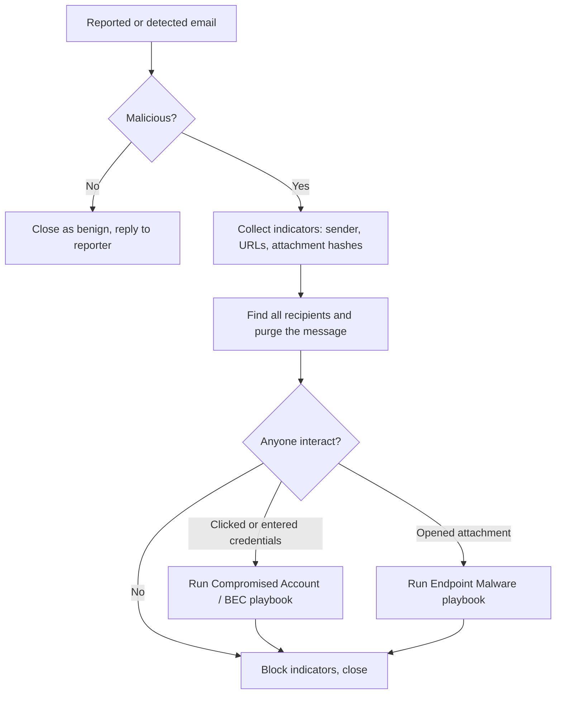

# Phishing

## Scope and Triggers

This playbook covers a malicious email that reached one or more mailboxes. It starts when:

* A user reports a suspicious email (report button, forwarded message, help desk ticket)
* Email security flags a message after delivery (for example a URL that turned malicious after delivery)
* Another investigation turns up a phishing email as the initial access vector

If the user entered credentials or the account is already showing suspicious activity, I run this playbook and the [Compromised Account / BEC](bec.md) playbook together.

## Severity

| Severity | Criteria |
| :--- | :--- |
| Low | Spam or a phish that was blocked or quarantined; no user interaction |
| Medium | Phish delivered to inboxes; no evidence anyone clicked, opened an attachment, or replied |
| High | A user clicked a credential harvesting link, opened a malicious attachment, or replied with information |
| Critical | Credentials were entered and used, malware executed, or a privileged account was targeted successfully |

## ATT&CK Mapping

* [T1566.001 Spearphishing Attachment](https://attack.mitre.org/techniques/T1566/001/)
* [T1566.002 Spearphishing Link](https://attack.mitre.org/techniques/T1566/002/)
* [T1204 User Execution](https://attack.mitre.org/techniques/T1204/)
* [T1598 Phishing for Information](https://attack.mitre.org/techniques/T1598/)

## Data Sources

* The original message as an .eml or .msg file, with full headers
* Email security logs: Defender for Office 365 (`EmailEvents`, `EmailUrlInfo`, `EmailAttachmentInfo`, `UrlClickEvents`) or the mail gateway
* Identity logs: Entra ID `SigninLogs`
* Endpoint telemetry from EDR: `DeviceProcessEvents`, `DeviceFileEvents`, `DeviceNetworkEvents`
* Web proxy and DNS logs

## Flow



## Triage

1. **Get the original message.** I ask for it as an attachment (or pull it from the mailbox or the email security portal) so the headers are intact. A forwarded copy loses the headers I need.
2. **Analyze the headers.** See [Email Headers](../../phishing-and-email/email-headers.md).
    * Check SPF, DKIM, and DMARC results in `Authentication-Results`
    * Compare the From, Reply-To, and Return-Path addresses
    * Trace the `Received` headers from the bottom up to find the sending server and IP
3. **Analyze the content.**
    * Extract every URL, including ones hidden behind buttons, QR codes, and redirects. I check the URLs in a sandbox such as urlscan.io instead of opening them on my workstation.
    * Hash attachments (SHA256) and check the hashes in VirusTotal or another reputation service. I only detonate attachments in a sandbox.
    * Note what the email is trying to get the user to do: log in, pay an invoice, open a file, call a number.
4. **Decide.** If it is benign or plain spam, I close the ticket and thank the reporter. If it is malicious, I record the indicators: sender address, sending IP, subject, URLs and domains, attachment names and hashes.

## Containment

1. **Find every recipient.** The reported copy is rarely the only one. I search for the same sender, subject, URL, or attachment hash across all mailboxes (see the queries below).
2. **Purge the message from all mailboxes.**
    * Defender for Office 365: Threat Explorer or the advanced hunting results -> Take action -> soft delete or move to Deleted Items
    * Without Defender: a Purview content search followed by `New-ComplianceSearchAction -Purge -PurgeType SoftDelete`
3. **Block the indicators.**
    * Sender address or domain in the tenant block list
    * URLs and domains in email security, the web proxy, and DNS filtering
    * Attachment hashes in EDR
4. **Check for interaction.** I look for anyone who clicked the link, opened the attachment, or replied. Clicks through to a credential page are the priority.
    * Clicked a credential harvesting link: I treat the account as compromised until proven otherwise. I reset the password, revoke sessions, and move to the [Compromised Account / BEC](bec.md) playbook.
    * Opened an attachment: I check EDR for process execution from the attachment and move to the [Endpoint Malware](endpoint-malware.md) playbook if anything ran.

## Eradication and Recovery

1. Confirm the purge worked by re-running the recipient search.
2. Confirm no inbox rules, forwarding, or OAuth app consents were created for affected users (covered in the BEC playbook).
3. Re-enable anything I disabled once the account or device is clean.

## Queries

All recipients of a message by sender or subject:

```kql
EmailEvents
| where Timestamp > ago(7d)
| where SenderFromAddress =~ "invoice@bad-domain.com" or Subject has "Overdue invoice"
| project Timestamp, NetworkMessageId, SenderFromAddress, SenderIPv4, RecipientEmailAddress, Subject, DeliveryAction, DeliveryLocation
```

All messages containing a malicious domain:

```kql
EmailUrlInfo
| where UrlDomain has "bad-domain.com"
| join kind=inner EmailEvents on NetworkMessageId
| project Timestamp, RecipientEmailAddress, SenderFromAddress, Subject, Url, DeliveryAction
```

Who clicked:

```kql
UrlClickEvents
| where Timestamp > ago(7d)
| where Url has "bad-domain.com"
| project Timestamp, AccountUpn, Url, ActionType, IsClickedThrough, IPAddress
```

Where an attachment landed on endpoints:

```kql
DeviceFileEvents
| where Timestamp > ago(7d)
| where SHA256 == "<attachment sha256>"
| project Timestamp, DeviceName, FolderPath, FileName, InitiatingProcessFileName, InitiatingProcessAccountName
```

Sign-ins for users who clicked, to look for use of stolen credentials:

```kql
SigninLogs
| where TimeGenerated > ago(7d)
| where UserPrincipalName in~ ("user1@example.com", "user2@example.com")
| project TimeGenerated, UserPrincipalName, IPAddress, Location, AppDisplayName, ResultType, AuthenticationRequirement
| order by TimeGenerated asc
```

## Communication

* **Reporter:** I thank them and tell them the outcome. People keep reporting when they hear back.
* **Users who interacted:** I contact them directly, without blame, to reset credentials and ask what they did.
* **All staff:** if the campaign was wide or convincing, I send a short warning with a screenshot of the email.
* **Management:** for High or Critical severity, or any case where credentials were used or malware ran.

## Close-out

* Keep the original message, header analysis, indicator list, recipient and click lists, and actions taken
* Add the indicators to block lists and threat intel
* Ask: why did this get through? Tune mail filtering, impersonation protection, or user training based on the answer
* Turn useful patterns (sender infrastructure, lure themes) into detections

## Related

* [Email Fundamentals](../../phishing-and-email/email-fundamentals.md)
* [Email Headers](../../phishing-and-email/email-headers.md)
* [Compromised Account / BEC](bec.md)
* [Endpoint Malware](endpoint-malware.md)
