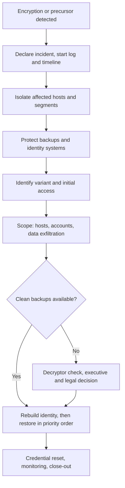

# Ransomware

## Scope and Triggers

This playbook covers ransomware encryption or a confirmed ransomware precursor. Modern ransomware is the last stage of an intrusion that usually started days or weeks earlier, so by the time files are encrypted the attacker typically has domain-level access and has often stolen data. This playbook starts when:

* Users report files that will not open, new file extensions, or ransom notes
* EDR alerts on mass file modification, shadow copy deletion, or a known ransomware family
* Precursor activity is found: Cobalt Strike or another C2 framework, credential dumping on a Domain Controller, mass deployment of tools with PsExec or Group Policy

## Severity

Ransomware is Critical by default. Precursor activity with no encryption is High, and I treat it with the same urgency because encryption may be hours away.

## ATT&CK Mapping

* [T1486 Data Encrypted for Impact](https://attack.mitre.org/techniques/T1486/)
* [T1490 Inhibit System Recovery](https://attack.mitre.org/techniques/T1490/)
* [T1489 Service Stop](https://attack.mitre.org/techniques/T1489/)
* [T1562.001 Impair Defenses: Disable or Modify Tools](https://attack.mitre.org/techniques/T1562/001/)
* [T1570 Lateral Tool Transfer](https://attack.mitre.org/techniques/T1570/)
* [T1484.001 Domain or Tenant Policy Modification: Group Policy Modification](https://attack.mitre.org/techniques/T1484/001/)
* [T1567 Exfiltration Over Web Service](https://attack.mitre.org/techniques/T1567/)

## Data Sources

* EDR telemetry and alerts
* Windows Security and System logs from Domain Controllers and servers
* Firewall, VPN, and proxy logs (initial access and exfiltration)
* Backup system logs and job history
* Ransom notes and encrypted file samples

## Flow



## First Hour

1. **Declare the incident and start a timeline.** I record every action with a timestamp from the start. I set up communication outside the affected environment (phones, a separate chat or email tenant) in case email and Teams are down or the attacker is watching them.
2. **Isolate, do not power off.** I isolate affected hosts with EDR network containment, or pull the network cable. Powering off destroys memory, which may hold encryption keys, attacker tooling, and evidence of how they got in. The exception is a host that is actively encrypting a file server share and cannot be isolated any other way.
3. **Contain the spread.**
    * Block traffic between network segments where I can, starting with SMB (445) and RDP (3389)
    * Disable VPN and remote access until I know whether it was the way in
    * Take affected file shares offline
4. **Protect backups.** I disconnect backup repositories from the network, confirm offline or immutable copies exist, and change backup console credentials. Attackers go after backups before encrypting.
5. **Protect identity.** If Domain Controllers are not yet encrypted, I make sure they are isolated from compromised segments and look for attacker-created accounts and Group Policy changes. A malicious GPO is a common way to push ransomware to every host at once.
6. **Bring in help early.** I contact the cyber insurance carrier first, because most policies require notification and their approved incident response firm, then legal counsel. Communication with the IR firm through counsel helps preserve privilege.

## Investigation and Scoping

1. **Identify the variant.** The ransom note, file extension, and a sample encrypted file usually identify the family. [ID Ransomware](https://id-ransomware.malwarehunterteam.com/) can help. I check [No More Ransom](https://www.nomoreransom.org/) for a free decryptor.
2. **Find patient zero and the access vector.** Common entry points are an unpatched VPN or firewall, exposed RDP, a phishing email, or stolen credentials. I work backward from the earliest suspicious activity.
3. **Scope the hosts and accounts involved.** I look for the attacker's tools and lateral movement across the environment (see the queries below), and list every account they used.
4. **Determine whether data was stolen.** Most ransomware groups steal data before encrypting and threaten to publish it. I look for large outbound transfers, cloud storage uploads, and tools like rclone, WinSCP, or MEGAsync. If the group runs a leak site, I check whether we have been listed.
5. **Preserve evidence** from key systems before rebuilding: memory and disk images where possible, logs exported off the affected systems, ransom notes, and samples.

## Recovery

1. **Rebuild identity first.** I restore or rebuild Domain Controllers from a backup that predates the compromise, or build new ones. Then I:
    * Reset the `krbtgt` password twice, with replication between resets
    * Reset passwords for every privileged account and service account
    * Remove attacker-created accounts, GPOs, and scheduled tasks
2. **Restore in priority order.** Core infrastructure (DNS, DHCP) -> backup and security tooling -> business-critical systems -> remaining servers -> endpoints. Every restored system gets patched, scanned, and EDR-enrolled before it rejoins the network.
3. **Rebuild instead of cleaning** where I can. Reimaging is faster to trust than hunting every persistence mechanism on a host the attacker controlled.
4. **Close the access vector** before reconnecting to the internet: patch the exploited device, remove exposed RDP, or reset the stolen credentials.
5. **Monitor closely** for re-entry for at least 30 days. Attackers who still have a foothold often come back.

## The Payment Question

Paying is a business, legal, and executive decision, not a technical one. My role is to give leadership the facts:

* Whether clean backups exist and how long a full restore will take
* Whether a free decryptor exists
* Whether data was stolen (payment does not guarantee deletion)
* That paying a sanctioned group can violate OFAC regulations, which counsel needs to check
* That decryptors from attackers are often slow and buggy, so restoration work is needed either way

## Queries

Shadow copy and backup deletion:

```kql
DeviceProcessEvents
| where Timestamp > ago(7d)
| where (FileName =~ "vssadmin.exe" and ProcessCommandLine has_all ("delete", "shadows"))
    or (FileName =~ "wmic.exe" and ProcessCommandLine has_all ("shadowcopy", "delete"))
    or (FileName =~ "wbadmin.exe" and ProcessCommandLine has "delete")
    or (FileName =~ "bcdedit.exe" and ProcessCommandLine has_any ("recoveryenabled", "bootstatuspolicy"))
| project Timestamp, DeviceName, AccountName, FileName, ProcessCommandLine, InitiatingProcessFileName
```

Hosts with mass file renames (likely encryption):

```kql
DeviceFileEvents
| where Timestamp > ago(1d)
| where ActionType == "FileRenamed"
| summarize Renames = count(), Extensions = make_set(tostring(split(FileName, ".")[-1]), 10) by DeviceName, InitiatingProcessFileName, bin(Timestamp, 10m)
| where Renames > 200
| order by Renames desc
```

Remote execution with PsExec and similar tools:

```kql
DeviceProcessEvents
| where Timestamp > ago(14d)
| where FileName in~ ("psexec.exe", "psexec64.exe", "paexec.exe") or InitiatingProcessFileName in~ ("psexesvc.exe", "paexec.exe")
| summarize Hosts = dcount(DeviceName), HostList = make_set(DeviceName, 50) by AccountName, ProcessCommandLine
```

Possible exfiltration tools:

```kql
DeviceProcessEvents
| where Timestamp > ago(30d)
| where FileName in~ ("rclone.exe", "winscp.exe", "megasync.exe", "filezilla.exe") or ProcessCommandLine has_any ("rclone", "mega.nz")
| project Timestamp, DeviceName, AccountName, FileName, ProcessCommandLine
```

Group Policy changes (Domain Controller Security log):

```kql
SecurityEvent
| where TimeGenerated > ago(14d)
| where EventID in (5136, 5137) and EventData has "groupPolicyContainer"
| project TimeGenerated, Computer, SubjectUserName, EventID, EventData
```

## Communication

* **Executives:** immediately, with an initial assessment and the next update time; then on a fixed schedule
* **Insurance carrier and legal counsel:** in the first hour
* **Law enforcement:** report to the [FBI IC3](https://www.ic3.gov/) or a local FBI field office, and to [CISA](https://www.cisa.gov/report); they may have decryptors or intelligence on the group
* **Staff:** what to do and not do (do not turn devices back on, do not reconnect, use the out-of-band channel)
* **Customers, partners, and regulators:** through legal, based on what data was affected and the notification laws that apply

## Close-out

* Keep the full timeline, evidence images, logs, ransom note, communications, and decisions with their reasoning
* Hold a lessons learned review with IT, leadership, and the IR firm
* Common follow-up work: offline and immutable backups with tested restores, MFA on all remote access, tiered admin accounts, EDR on every host, faster patching of internet-facing systems
* Detections to add: shadow copy deletion, mass renames, PsExec from unusual accounts, new GPOs, rclone and similar tools

## Related

* [Containment, Eradication, and Recovery](../../incident-response/containment-eradication-recovery.md)
* [Active Directory Privileged Compromise](ad-privileged-compromise.md)
* [Exploited Edge Device](edge-device-exploitation.md)
* [MITRE ATT&CK: Impact](../../threat-intelligence/mitre-attack.md#impact)
